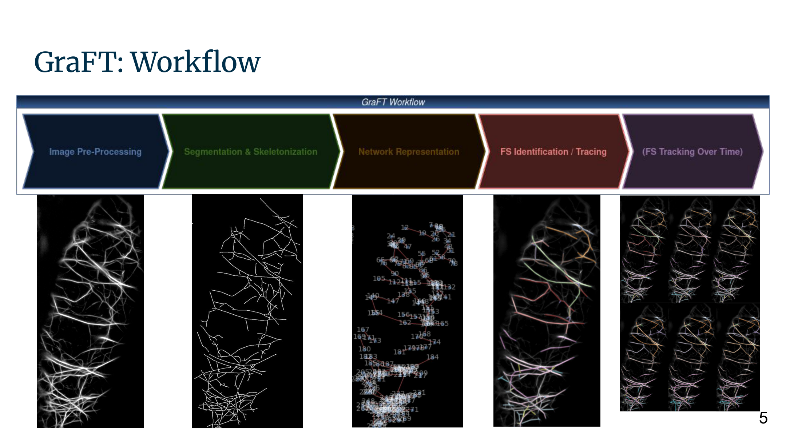
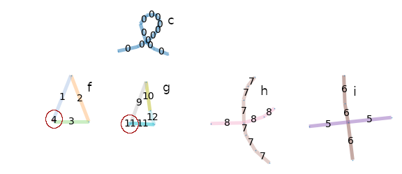
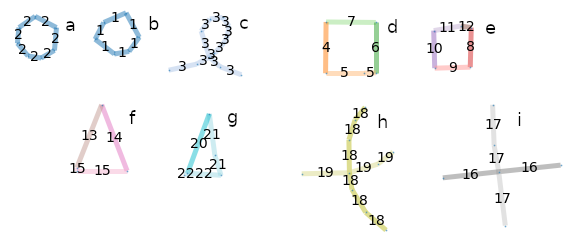
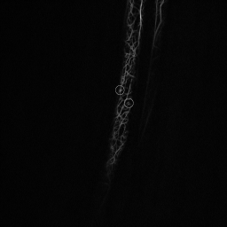
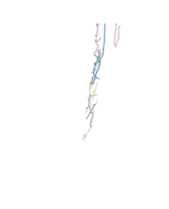
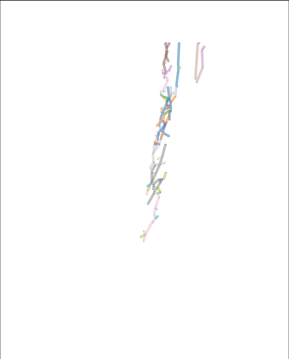

# GraFT — Closed-Shape & Constraint Extensions

A graph-based pipeline for tracing actin filament structures in plant-cell microscopy
images. This repository extends the original
[GraFT tool by Isabella Østerlund](https://github.com/Oesterlund/GraFT) with new
capabilities for tracing closed-shape filament formations and a richer set of segmentation
constraints that reduce undersegmentation.

**[▶ Live demo](https://graft-tracing-extension.streamlit.app)**  ·  actin filament tracing  ·  closed-shape + multi-constraint extension

| | |
|---|---|
| What | extends GraFT to trace closed-shape (loop/ring) filaments and adds intensity/thickness scoring constraints |
| Input | fluorescence microscopy of actin (*Arabidopsis*) and synthetic shape benchmarks |
| Method | constrained depth-first search over a graph skeleton, with CLI-tunable scoring weights |
| Result | traces closed shapes the original could not; strict pixel-F1 ≈ 0.65–0.84 across the synthetic benchmarks |

> **Relationship to the original GraFT.** This is a derivative work. The core
> graph-construction approach comes from GraFT (MIT licensed); the contributions in this
> repository are the closed-shape tracing logic, the additional intensity/thickness/angle
> constraints in the tracing step, and a restructured, documented, command-line-driven
> workflow. See [Contributions](#whats-new-in-this-fork) and [Citation](#citation).

---

## Table of contents

- [Background](#background)
- [What's new in this fork](#whats-new-in-this-fork)
- [Results](#results)
- [Repository structure](#repository-structure)
- [Installation](#installation)
- [Usage](#usage)
- [Interactive GUI](#interactive-gui)
- [Outputs](#outputs)
- [Evaluation](#evaluation)
- [Data & ground truth](#data--ground-truth)
- [Limitations & future work](#limitations--future-work)
- [Citation](#citation)
- [License](#license)
- [Acknowledgements](#acknowledgements)

---

## Background

Actin filaments form dynamic network structures inside plant cells. Automatically tracing
individual filaments from fluorescence microscopy is the basis for quantifying network
organisation (orientation, length, density).

GraFT models the segmented filament skeleton as a graph: junction and endpoint pixels
become nodes, and the skeleton segments between them become edges. Individual filaments are
then recovered by a constrained depth-first search (DFS) over that graph.

Why a graph rather than the raw pixels? Dense actin networks cross and overlap, so a
pixel-level tracer easily merges two filaments that happen to touch, or drops one where its
intensity dips. Reducing the skeleton to nodes (junctions and filament tips) and edges (the
actin segments between them) turns "follow a filament" into a graph-traversal problem, where
continuity can be enforced with explicit, tunable rules at each branch point. Biologically,
each edge is a stretch of actin and each node a junction or tip, so one traced path is one
filament, and the recovered graph feeds downstream measures like filament length,
orientation, and local network density.



*The pipeline: a microscopy image is pre-processed and skeletonised, turned into a graph,
then traced filament by filament with the constrained DFS. This fork extends the tracing
step with closed-shape handling and intensity/thickness constraints.*

The original GraFT works well for open, tree-like filament networks but, in our plant-cell
data, struggled with two situations:

1. Closed shapes (loops / rings): could not be fully traced.
2. Undersegmentation: distinct filaments were sometimes merged into one.

This project was developed as a bioinformatics master's project to address both.

## What's new in this fork

| Area | Original GraFT | This fork |
|------|----------------|-----------|
| Closed shapes | Not fully traced | Dedicated handling of cycles and "single-dangling-node" loops in the DFS |
| Tracing constraints | Angle-based | Scoring system combining intensity, thickness, and angle with CLI-tunable weights, a toggleable angle penalty, and per-component dynamic tolerances |
| Node placement | VW-based | Optional nodes where thickness/intensity change sharply (`insert_nodes_by_thickness_intensity_dynamic`, `--node-extension`) |
| Preprocessing | Fixed | Two modes: `full` (Frangi tubeness, for thin fluorescence) and `binary` (for thick/synthetic inputs) |
| Interface | Script with inline paths | `argparse` CLI, `logging`, reproducible env files |
| Evaluation | None | Pixel-level F1 / IoU / MCC vs. ground truth, over-segmentation metrics, and percentile-sweep heatmaps |

> A detailed write-up of the methodology and results is in the
> [project report](docs/GraFT_extension_report.pdf).

## Results

The main contribution is tracing closed shapes (loops and rings) that the original GraFT
skips, and reducing the undersegmentation that merges distinct filaments. On a synthetic
benchmark of nine shapes the original traces only five of them, omitting the two circles and
two squares; the extended tracer closes those loops and recovers all nine:

| Original GraFT (closed shapes skipped) | Extended GraFT (closed shapes traced) |
|---|---|
|  |  |

Strict pixel-F1 across the synthetic cases is ≈ 0.65–0.84; see [Usage](#usage) for the
per-case commands and numbers.

On real microscopy (an *Arabidopsis thaliana* seedling) the pipeline traces the actin
network, with the extended version recovering more of the structure than the original:

| Microscopy input | Original GraFT | Extended GraFT |
|---|---|---|
|  |  |  |

The biological result is preliminary and qualitative: the pre-processing and the new
constraints would need to be tuned together to quantify it, which was beyond this project's
scope (see [Limitations & future work](#limitations--future-work)).

## Repository structure

```
.
├── GraFT_workflow_still_improved_iterations1.py   # main entry point (CLI)
├── utilsGraFT.py                                  # all algorithm functions
├── gui_app.py                                     # optional Streamlit GUI
├── graft_core.py                                  # importable pipeline stages (used by the GUI)
├── environment-conda.yml                          # conda/mamba environment (local)
├── requirements.txt                               # pip deps (also used by hosted demo)
├── tools/
│   └── prepare_ground_truth.py                    # convert hand tracings → label masks
├── extras/
│   └── orientation_analysis.py                    # future-work: filament orientation /
│                                                  #   circular stats (not wired into pipeline)
├── data_samples/
│   ├── test_data/                                 # demo input images
│   ├── labeled_ground_truth/                      # manual GT, one folder per image
│   │   ├── simple_shapes/
│   │   ├── shape_constraint_test_modified_gray/
│   │   └── shape_modified_gray/
│   └── biological/                                # Arabidopsis example (source: Østerlund, Zenodo)
│       ├── slice1/                                #   image.png + raw_layers/ + ground_truth/
│       ├── slice2/
│       └── unusable_single_layer/                 #   early single-layer attempt (documented)
├── docs/
│   ├── GraFT_extension_report.pdf                 # the project report
│   └── GraFT_extension_presentation.pdf           # project slides
├── LICENSE
└── README.md
```

## Installation

Recommended, conda / mamba (miniforge):

```bash
mamba env create -f environment-conda.yml
mamba activate graft_project
```

Alternative, pip:

```bash
pip install -r requirements.txt
```

> The conda route is preferred: several dependencies (`scikit-image`, `scipy`, and the
> Rust-backed `simplification`) ship pre-built binaries on conda-forge, avoiding
> compiler/toolchain issues.

## Usage

```bash
python GraFT_workflow_still_improved_iterations1.py \
    --image  path/to/image.png \
    --output path/to/output_dir \
    [--gt path/to/ground_truth_folder] \
    [--preprocess {full,binary}]
```

See all options with `--help`.

### Choosing a preprocessing mode

| Mode | Pipeline | Use for |
|------|----------|---------|
| `--preprocess full` *(default)* | Gaussian → Frangi tubeness → CLAHE → median → Otsu hysteresis → skeletonize | Real fluorescence microscopy |
| `--preprocess binary` | skeletonize + prune only | Synthetic / hand-drawn / already-binarised inputs |

### Worked examples (reproducible demos)

The `data_samples/` folder ships small inputs with ground truth, each chosen to exercise a
different part of the pipeline. Prefix any command with `MPLBACKEND=Agg` to run head-less
(no figure windows).

#### 1. `simple_shapes`: full preprocessing on thin line-art

```bash
python GraFT_workflow_still_improved_iterations1.py \
    --image data_samples/test_data/simple_shapes.jpg \
    --output results_simple_shapes \
    --gt data_samples/labeled_ground_truth/simple_shapes \
    --preprocess full
```

Thin strokes are what the Frangi tubeness filter is built for, so the `full`
pipeline applies here. Gives strict F1 ≈ 0.84 (lenient overlap F1 ≈ 0.92).

#### 2. `shape_constraint`: trace through sharp bends (thickness/intensity over angle)

```bash
python GraFT_workflow_still_improved_iterations1.py \
    --image data_samples/test_data/shape_constraint_test_modified_gray.png \
    --output results_shape_constraint \
    --gt data_samples/labeled_ground_truth/shape_constraint_test_modified_gray \
    --preprocess binary --node-extension --intensity-coeff 4 --thickness-coeff 4
```

Thick solid strokes need `binary` (Frangi would outline them into loops). Raising the
intensity/thickness weights to 4 each (vs the angle weight 5) lets the tracer follow the
bends by trusting intensity/thickness continuity. Gives strict F1 ≈ 0.82, filament-level
MCC 1.00 (lenient overlap F1 ≈ 0.94).

#### 3. `shape_constraint` (demonstration): bypass the angle constraint entirely

```bash
python GraFT_workflow_still_improved_iterations1.py \
    --image data_samples/test_data/shape_constraint_test_modified_gray.png \
    --output results_shape_constraint_either15 \
    --gt data_samples/labeled_ground_truth/shape_constraint_test_modified_gray \
    --preprocess binary --node-extension --intensity-coeff 4 --thickness-coeff 4 \
    --either-constraint-coeff 15
```

A teaching demo: with `--either-constraint-coeff 15`, satisfying *either* the intensity or
thickness constraint forces the edge to be kept regardless of angle, so a sharp zigzag is
traced as one continuous filament. Strict F1 drops to ≈ 0.71 (lenient overlap ≈ 0.82)
because it over-merges relative to the ground truth on purpose; it shows the mechanism,
not the best accuracy.

#### 4. `shape_modified`: dynamic-vs-fixed tolerance tradeoff

```bash
python GraFT_workflow_still_improved_iterations1.py \
    --image data_samples/test_data/shape_modified_gray.png \
    --output results_shape_modified \
    --gt data_samples/labeled_ground_truth/shape_modified_gray \
    --preprocess binary
```

One run yields both a percentile-sweep trace (resolves the crossings) and a fixed-tolerance
"arbitrary" trace (closes the ring), illustrating when to prefer dynamic per-component vs
fixed global tolerances. Gives strict F1 ≈ 0.65 (lenient overlap ≈ 0.78).

#### Real microscopy image (no ground truth)

```bash
python GraFT_workflow_still_improved_iterations1.py \
    --image cell.tif --output results/ --preprocess full
```

For verbose tracing while debugging, append `--log-level DEBUG`.

### Key parameters

#### Segmentation & graph construction

| Flag | Default | Meaning |
|------|---------|---------|
| `--sigma` | 1.0 | Gaussian sigma (full preprocessing only) |
| `--small` | 50 | Minimum connected-component size (pixels) to keep |
| `--thresh_top` | 0.5 | Hysteresis lower-threshold ratio (full only) |
| `--size` | 6 | Kernel size for node condensation |
| `--eps` | 200 | Epsilon for Visvalingam–Whyatt node placement (larger → fewer bend nodes) |
| `--node-extension` | off | Insert extra nodes where thickness/intensity change sharply |

#### Tracing / DFS scoring

Each candidate edge accumulates a score; the edge is kept when
`total_score ≥ score-threshold`. Intensity within tolerance adds `intensity-coeff`,
thickness within tolerance adds `thickness-coeff`, and the angle term adds `angle-coeff`
(straight) or subtracts it (sharp). So a sharp corner is kept when:

```
intensity-coeff + thickness-coeff − angle-coeff  ≥  score-threshold
```

| Flag | Default | Meaning |
|------|---------|---------|
| `--angle` | 140 | Minimum angle (deg) allowed between consecutive edges (the gate) |
| `--overlap` | 4 | Maximum permitted edge overlap between traced filaments |
| `--intensity-coeff` | 3 | Score reward when intensity stays within tolerance |
| `--thickness-coeff` | 3 | Score reward when thickness stays within tolerance |
| `--angle-coeff` | 5 | Reward for a straight continuation / penalty for a sharp turn |
| `--score-threshold` | 8 | Minimum total score to keep an edge |
| `--disable-angle-penalty` | off | Drop the penalty at badly-violated angles (lets sharp corners survive on intensity/thickness alone) |
| `--either-constraint-coeff` | 0 | Demo override: if >0, add this bonus when *either* intensity or thickness is satisfied, forcing the edge regardless of angle |
| `--arb-only` | off | Skip the 121-combo percentile sweep; run only the fixed-tolerance "arbitrary" trace (fast) |

All scoring defaults (3 / 3 / 5 / 8, penalty on, no either-bonus) reproduce the original
tracing behaviour; the flags above only change it when set.

## Interactive GUI

An optional Streamlit front-end exposes the same pipeline with live sliders, handy for
exploring parameters without re-typing CLI flags.

**Try it live (no install):** https://graft-tracing-extension.streamlit.app

The hosted demo runs the same `gui_app.py`. Load the bundled sample image and run a single
trace to see it work in seconds; very large uploads or the full percentile sweep are better
run locally (see below), as the free hosting tier is memory- and CPU-limited. The app may
sleep after inactivity; click *wake up* and allow about 30 s for the first load.

To run it locally instead:

```bash
pip install streamlit          # optional, GUI only
streamlit run gui_app.py
```

It opens in the browser with three areas:

- Left: sliders for every parameter, grouped into *Segmentation & graph* and *Tracing*,
  plus the image / ground-truth inputs and a Run button.
- Centre: the traced filaments.
- Right: the evaluation panel (strict + overlap F1/IoU, MCC, over-segmentation) and a
  predicted-vs-ground-truth view, shown when a ground-truth folder is given.

The heavy segmentation + graph build is cached, so adjusting a *tracing* slider and clicking
Run re-traces in about 1–2 s. The GUI drives the same pipeline as the CLI through
`graft_core.py`; it does not change any tracing behaviour.

## Outputs

The `--output` directory is populated with:

```
output_dir/
├── n_graphs/                 # graph drawings (untagged + per-percentile traces)
├── evaluation_plots/         # per-percentile evaluation figures (if --gt given)
├── evaluation_metrics.xlsx   # all metrics across the percentile sweep
├── overall_f1_heatmap.png
├── MCC_f1_heatmap.png
└── MCC_mcc_heatmap.png
```

## Evaluation

When a ground-truth folder is supplied (one binary mask per filament), the workflow sweeps
intensity and thickness percentile thresholds (0–100 in steps of 10) and, for each
combination, computes pixel-level precision, recall, F1, IoU, and a filament-level MCC.
Results are written to `evaluation_metrics.xlsx` and summarised as heatmaps, making it easy
to see which threshold combination performs best.

Two precision/recall conventions are reported. The primary `precision`, `recall`,
`f1_score`, `iou` use the strict definition: a predicted pixel that is not in the matched
ground-truth filament is a false positive (`fp = predicted_size − tp`), and an uncovered GT
pixel is a false negative (`fn = gt_size − tp`), i.e. the standard per-filament Dice/IoU.
The same metrics with an `_overlap` suffix use a lenient definition that counts only pixels
overlapping *some other* filament, so it ignores predicted pixels that miss every GT
filament and reads higher. The strict version is the default everywhere (including
best-combo selection); the `_overlap` columns are kept for comparison.

Because the filament-level MCC is presence-based (and its true-negative term is inflated by
the number of prediction × ground-truth pairs), it can read as "perfect" even when a single
filament is split into several. Two over-segmentation measures are therefore reported
alongside it:

- `oversegmentation_ratio`: matched predicted fragments ÷ ground-truth filaments hit
  (`1.0` = clean 1:1, `>1` = over-segmented, `<1` = under-segmented).
- `gt_oversegmented`: number of ground-truth filaments split into more than one predicted
  fragment.

These appear in the summary log and in `key_graphs/key_metrics.csv`.

## Data & ground truth

Example inputs and their manually-labelled ground truth ship under `data_samples/`:

- Synthetic shapes (`test_data/` + `labeled_ground_truth/`): hand-drawn open and closed
  shapes that serve as the primary benchmark. Ground truth was traced layer-by-layer (so
  filaments do not overlap) and labelled by hand.
- Biological example (`biological/slice1`, `biological/slice2`): two slices from the bottom
  region of an *Arabidopsis thaliana* seedling (actin tagged with the mNeonGreen-FABD2
  marker, confocal microscopy), from the public dataset by Isabella Østerlund on Zenodo:
  <https://zenodo.org/records/10476058>. Each slice has an `image.png`, the 5 hand-traced
  `raw_layers/`, and the 5 `ground_truth/label*.png` masks generated from them. An early
  all-in-one-layer attempt is kept under `biological/unusable_single_layer/` to document the
  pitfall of tracing overlapping filaments in a single coloured image.

> Status of the biological example. It is included to show how the pipeline behaves on real
> microscopy, but its quantitative performance was not finalised: the preprocessing
> parameters and the new intensity/thickness constraints need to be tuned jointly, which was
> beyond this project's scope. Treat it as a qualitative, preliminary application instead of
> a benchmark result. The manual labelling alone took about 50 hours and is released as a
> small annotated-actin resource in its own right.

### Converting hand tracings into label masks

Hand tracing produces strokes on a white canvas (often coloured), but the evaluation needs
per-filament masks with a black background named `label1.png …`.
`tools/prepare_ground_truth.py` does that conversion: it auto-detects background polarity,
thresholds, drops empty/speckle layers, and writes correctly-named masks:

```bash
# one filament per layer (recommended)
python tools/prepare_ground_truth.py layers \
    --input  data_samples/biological/slice1/raw_layers \
    --output data_samples/biological/slice1/ground_truth \
    --threshold 15 --min-pixels 30 --preview
```

It also has a best-effort `composite` mode for a single multi-colour image, but overlapping
strokes cannot be separated reliably, so prefer one-filament-per-layer tracing (see
`biological/unusable_single_layer/`).

## Limitations & future work

The extension improves robustness on closed shapes and overlapping filaments, but several
limitations remain and point to clear next steps:

- Parameter burden. Adding the intensity and thickness constraints introduces several
  weights and tolerances that must be tuned for good results, and their optimal values vary
  widely between images. Only the angle constraint generalises reliably (actin filaments
  cannot bend beyond a physical limit, so its gate can be fixed with confidence); the
  intensity/thickness settings cannot yet be set once and for all.
- Segmentation sensitivity. The trace is only as good as the upstream skeleton: where
  pre-processing under- or over-segments the image (as happened on the biological data), the
  graph is already wrong before tracing starts, so the pre-processing and tracing parameters
  have to be tuned together rather than in isolation.
- Computational cost. Handling more closed shapes and extreme cases adds nodes and makes the
  pipeline heavier and slower. This matters even more once temporal tracking (not
  implemented here) is layered on top of tracing, since tracing alone with all the
  additional nodes is already computationally demanding.
- Ground truth & quantification. Defining what counts as one filament depends on
  time-consuming manual labelling. Actin's dynamic, dense, highly-bent networks are far
  harder to annotate than microtubules (filaments are often hard to separate even by eye),
  which makes quantitative evaluation difficult. The same bottleneck blocks
  machine-learning automation, a natural long-term direction that would first require a
  large corpus of labelled data.
- Filament orientation / circular statistics. A prototype that quantifies filament
  orientation relative to the major cell axis (mean/variance of angle, a polar histogram)
  lives in [`extras/orientation_analysis.py`](extras/orientation_analysis.py). It is
  isolated from the tracing pipeline and not yet wired in or validated on the current data,
  a clear starting point for extending the analysis side. It needs the optional
  `astropy`/`plotly` packages (see the dependency files).

## Citation

If you use this code, please cite both the original GraFT and this extension.

Original GraFT:

> Østerlund, I. et al. *GraFT: A robust network-based spatiotemporal analysis of
> filamentous structures.* Science Advances (2025).
> https://doi.org/10.1126/sciadv.adz4132 ·
> Code: https://github.com/Oesterlund/GraFT

This extension:

> Zhu, S. *Refining a Network-Based Framework for Accurate Actin Filament
> Identification.* M.Sc. Bioinformatics project work, University of Potsdam, 2024.
> Full report: [`docs/GraFT_extension_report.pdf`](docs/GraFT_extension_report.pdf) ·
> Slides: [`docs/GraFT_extension_presentation.pdf`](docs/GraFT_extension_presentation.pdf).

The report is included in this repository (`docs/`) since it is not published elsewhere. For
a permanent, citable DOI you can optionally deposit it on [Zenodo](https://zenodo.org/);
Zenodo integrates with GitHub releases and will mint a DOI you can cite here instead of the
file path.

## License

[MIT](LICENSE), consistent with the original GraFT license. The original copyright notice is
retained in [`LICENSE`](LICENSE) as required.

## Acknowledgements

Built on the [GraFT](https://github.com/Oesterlund/GraFT) tool by Isabella Østerlund and
contributors. The biological microscopy used here comes from Isabella Østerlund's public
*Arabidopsis thaliana* dataset on [Zenodo](https://zenodo.org/records/10476058). Thanks to
the supervisors, Dr. Jacqueline Nowak and Prof. Dr. Zoran Nikoloski, for their guidance
during this project.
